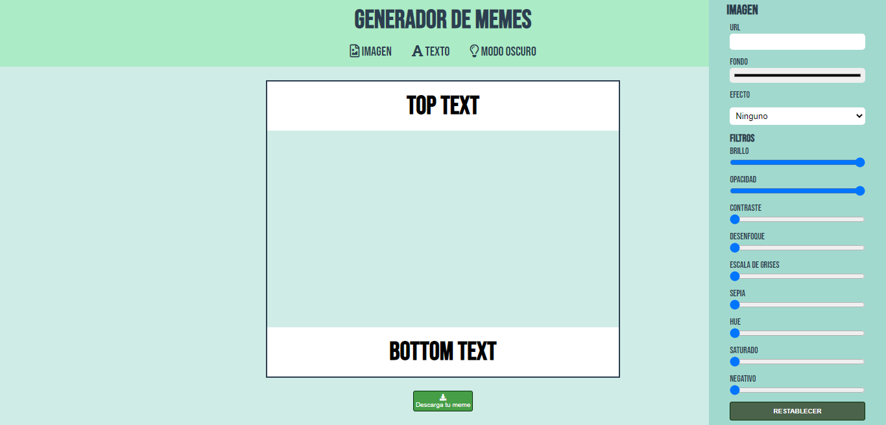
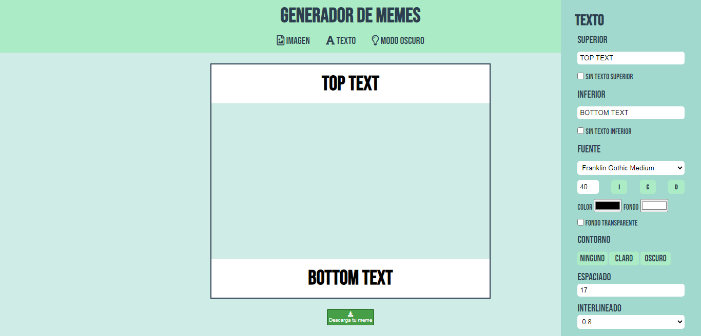
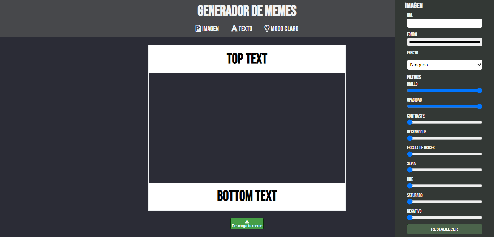
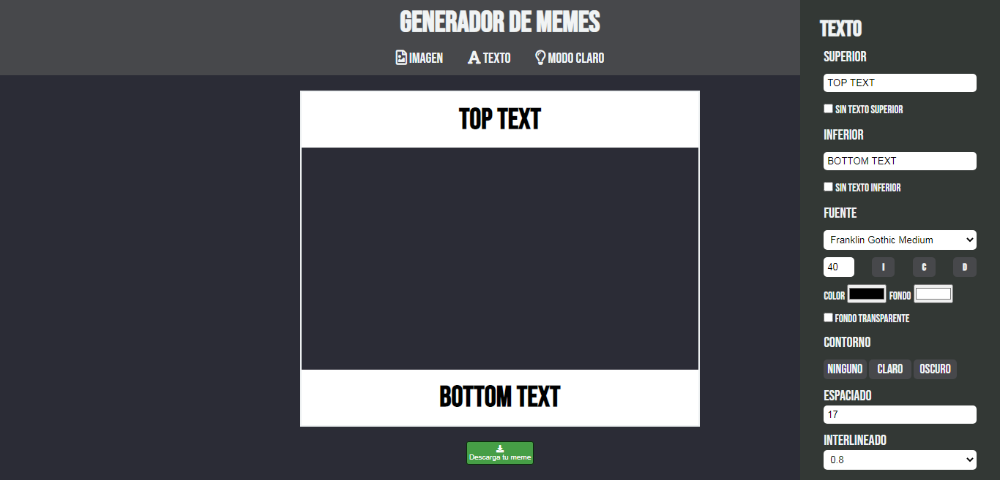

# Generador de memes

### Este es el segundo proyecto de mi autoría, propuesto por ADA IT, para implementar conocimientos adquiridos de Javascript y afianzar maquetado y estilos con HTML5 y CSS3.

 

### ¿Te gustaría ver como quedó? podes verlo en este [enlace](https://noedelcorti.github.io/generador-de-memes/) o también podes hacerlo desde acá [aca](https://unruffled-raman-9be29e.netlify.app).

 

### Si queres tener el código en tu computadora, seguí los siguentes pasos en tu terminal.

- Ir al repositorio [repositorio](https://github.com/NoeDelCorti/generador-de-memes)
- Darle clik al botón de code.
- Copiar la url.
- Abrir tu terminal y poner el comando de
**git clone <url>**.
- Entrar a la carpeta del proyecto en tu IDE.

 

## Este proyecto no precisa de la instalación de ninguna dependencia, programa, app o simil al momento, la idea es que puedas generar tu propio meme desde cuaquier dispositivo, ya que tiene un diseño responsivo.

---

### Así debería ser el resultado final de tu instalación.

 

---
 
 

### Este proyecto es mucho más de lo que alguna vez pensé podría generar, es tambien una muestra de el cambio de paradigma que se activó al momento que decidí acercarme a [Ada](https://github.com/Ada-IT) e incursionar en algo totalmemnte diferente a lo que alguna vez hice, pero afortunadamente la vida esta llena de primeras veces y nuevos comienzos. Gracias [Ada-IT](https://www.linkedin.com/school/ada-itw/) por la iniciativa tan necesaria de este espacio pensado para mujeres y femeneidades, con el fin de empoderarnos y disminuir la brecha de genero en el rubro. No es al azar el que hecho de construir entre pares devenga en el comienzo de nuevos y amorosos vinculos, el hecho de cursar con pares me hace reconfirmar una vez más que los caminos están y estarán llenos de diferentes personas con diferentes vivencias y aspiraciones, y entre ellas más allá de las lógicas, las habilidades blandas son las que nos ayudan a generar lazos firmes de empatía y compañerismo. En este módulo, mis compañerxs "AtrasADA´s en TODO", jugaron un papel importantisimo, su escucha, sus palabras de aliento, su generocidad en compartir y su gran sentido del humor, hicieron que no desistiera en la difícil tarea de sortear la frustración que genera el no saber, el no entender, el no avanzar. Gracias [Naty Sacias](https://github.com/Naty1401) por su generosidad, cariño y por su paciencia, sin dudas no hubiese llegado sin su ayuda, y por último gracias a [Jonh Parra](https://github.com/Jonhks) por ser un profesor el cual se preocupa por que aprendamos, sin importarle explicar 10 veces (o más) la misma cosa.

 

### Hecho con amor y desde el <3 por Noe.